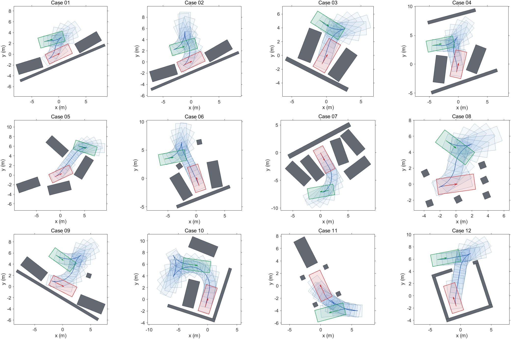
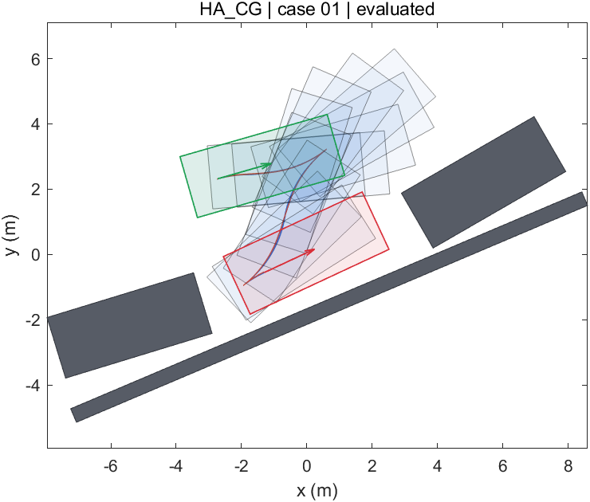

# CommonParking

A MATLAB benchmark for motion planning in 12 static terminal-parking scenes. The accepted scene geometry and start/goal poses are frozen. Each scene requires local maneuvering; these are not long-range driving or valet-parking route tasks.

## Quick start

```matlab
cd('path/to/CommonParking');
SetupCommonParking;
caseData = LoadCase(1);             % inspect the scene independently
result = RunPlanner('HA_CG', 1);    % exactly two required inputs, one case
evaluation = EvaluateResult(result, caseData);
disp(evaluation.metrics);
PlotEvaluation(result, evaluation, caseData);  % optional
save('my_result.mat','result','evaluation');   % explicit output destination
```

`RunMe.m` shows the separate loading, planning, evaluation and plotting steps. `RunPlanner` itself neither saves files nor opens plots. Its only inputs are a method name and an integer case ID from 1 to 12. Algorithm settings are inside each planner's `Config.m`. Public `result` objects have exactly two possible kinds: `path` or `trajectory`; see [the complete result contract](docs/RESULT_FORMAT.md).

MATLAB R2024a was used for validation. HA+CG needs Navigation Toolbox for Reeds-Shepp and Dubins primitives. H-OBCA additionally uses Optimization Toolbox for its geometric dual seed. STC, LIOM, H-OBCA, TriangleArea, BOMP, LatticeOCP and evaluation need a separately installed AMPL/Ipopt runtime:

```matlab
setpref('CommonParking','AmplDirectory','path/to/your/ampl-and-ipopt-folder');
```

Alternatively set the `COMMONPARKING_AMPL_DIR` environment variable. Proprietary runtime executables and licenses are not redistributed. No paid service or online API is called by the benchmark. Solver scratch files go to `tempdir/CommonParking` by default, or `COMMONPARKING_WORK`; they are never written into the source repository.

BiRRT* + HC-Steer needs a one-time native MATLAB module build: run `BuildHCSteer` with a configured C++ compiler. The optional portable Zig build and external cache location are documented in [its planner README](planners/BiRRT_HC/README.md).

Lattice + OCP similarly needs `BuildLatticeGraph` once. Its validated offline primitive library and heuristic are included under the planner folder; offline preparation is excluded from online timing and can be reproduced using the documented builders.

SLiFS and DL-IAPS/PJSO additionally need MATLAB Optimization Toolbox (`quadprog`); their planners have no AMPL dependency. The common evaluator still uses the external AMPL/Ipopt runtime.

Saved results can be loaded uniformly with `[result,metrics,evaluationStatus] = LoadPublishedResult('LamirauxSmooth',2)`. Most are single MAT files. Two larger artifacts are stored in lossless binary chunks because of the publication transport's request-size limit; the loader checks their byte count and SHA-256 before loading a temporary MAT file outside the repository. No samples or precision are discarded. The stored result has the same standard structure as a fresh planner call.

Eta3 needs MATLAB Optimization Toolbox (`fmincon`) and Navigation Toolbox for its disclosed initialization adapter. Its planner has no AMPL dependency.

SE2_NMPC uses the external AMPL/Ipopt runtime (MA97), plus Navigation Toolbox for its disclosed Hybrid A* cold start. Its configuration and all model equations are contained in its planner folder.

HyperplaneOCP uses the external AMPL/Ipopt runtime (MA97). Its complete model, numerical settings and paper-to-code mapping are in [its planner folder](planners/HyperplaneOCP/README.md).

VPF uses the external AMPL/Ipopt runtime (MA97). Its complete model, numerical settings and paper-to-code mapping are in [its planner folder](planners/VPF/README.md).

RITP needs MATLAB Optimization Toolbox and Parallel Computing Toolbox, plus Navigation Toolbox for Hybrid A* initialization. The planner itself has no AMPL dependency.

AnytimePSRO uses the external AMPL/Ipopt runtime with MA27. All frozen-sign constraints and the explicit-Euler model are provided in [its planner folder](planners/AnytimePSRO/README.md).

DPGrid needs a one-time C++ module build with `BuildDPGrid`; it uses base MATLAB for its planner and has no optimizer or Navigation Toolbox dependency. [Build instructions and source](planners/DPGrid/README.md).

## Scenes and common vehicle

The twelve case MAT files are in `cases/`; `CaseCatalog.csv` describes them and `SHA256.json` records their immutable hashes. Polygon obstacles use explicit vertex fields. Positions refer to the rear-axle midpoint; metres, seconds and radians are used. Goal orientation is compared modulo 2*pi. Tasks start and finish at rest.

| Quantity | Value |
|---|---:|
| Wheelbase | 2.8 m |
| Front / rear overhang | 0.96 / 0.929 m |
| Width / total length | 1.942 / 4.689 m |
| Forward / reverse speed magnitude | 2.5 / 2.5 m/s |
| Acceleration / braking magnitude | 1.0 / 1.0 m/s² |
| Front steering angle magnitude | 0.7 rad |
| Steering rate magnitude | 0.5 rad/s |

Geometry follows the TPCAP demonstration vehicle. Motion bounds are the explicitly adopted CommonParking rules, not an assertion that all historical TPCAP releases used identical limits. All values are centralized in `BenchmarkConfig.m`.

## Evaluation: independent dimensions, no overall score

The open evaluator screens malformed or grossly mismatched submissions, adds exact cusp-to-cusp minimum-time longitudinal timing to geometric paths, and solves an obstacle-free, whole-horizon nonlinear tracking problem. Motion limits are relaxed by **0.1%**, with unchanged vehicle geometry. It independently integrates the optimized controls and checks full-body collisions at **1 ms** frames, including the exact final time. Tracking collocation starts at 2,001 nodes and refines if numerical checks require it.

The tracker has free duration with a published time-scaling range and weak regularization. This differs from the original TPCAP fixed-timeline code. Its terminal pose is free, so final accuracy can actually be measured. [The complete evaluation specification](evaluation/README.md) states the equations, tolerances, source-code differences, interpolation, input rejection conditions, solver success handling, and all weights.

Reported dimensions are collision-frame percentage; terminal attainment (each XY error <= 1 cm and wrapped heading error <= 1 degree); executed duration; and smoothness/control-effort components. Planner computation time is reported separately. The smoothness index retains TPCAP's weights 10, 10 and 5 for the control-effort integral, steering integral and gear changes. It excludes the old time term and all competition penalties. It is not energy in joules and is not an aggregate benchmark score.

Planner success, evaluation success and terminal attainment are three different flags. A successfully evaluated path can collide or miss the goal tolerance. Invalid input or tracking failure yields a documented failure code and unavailable metrics, not an arbitrary penalty score.

## Available planners

| Name | Output | Reference | Status |
|---|---|---|---|
| [HA+CG](planners/HA_CG/README.md) (`HA_CG`) | Path | Dolgov, Thrun, Montemerlo & Diebel, IJRR 2010 | Implemented and tested on all 12 cases |
| [STC](planners/STC/README.md) (`STC`) | Trajectory | Li et al., ECC 2020; documented multi-disc extension | Implemented and tested on all 12 cases |
| [H-OBCA](planners/H_OBCA/README.md) (`H_OBCA`) | Trajectory | Zhang, Liniger, Sakai & Borrelli, CDC 2018 | Implemented and tested on all 12 cases |
| [Backward dynamic programming](planners/DPGrid/README.md) (`DPGrid`) | Path | Schildbach & Borrelli, IV 2016; finite pose grid with continuous steering arcs | Implemented and tested on all 12 cases |
| [Anytime PSRO](planners/AnytimePSRO/README.md) (`AnytimePSRO`) | Trajectory | Chen et al., TVT 2025; frozen triangle signs, trust regions and iterative OCPs | Implemented and tested on all 12 cases |
| [Rapid iterative trajectory planning](planners/RITP/README.md) (`RITP`) | Trajectory | Li et al., RAS 2024; polynomial QPs and parallel collision-weight iterations | Implemented and tested on all 12 cases |
| [Virtual protection frames](planners/VPF/README.md) (`VPF`) | Trajectory | Zhang et al., IET ITS 2021; RK4 multiple shooting and iterative protection frames | Implemented and tested on all 12 cases |
| [Primal hyperplane OCP](planners/HyperplaneOCP/README.md) (`HyperplaneOCP`) | Trajectory | Fan, Murgovski & Liang, TITS 2024; polytope separating planes and time/energy OCP | Implemented and tested on all 12 cases |
| [Orientation-aware space exploration](planners/OSEHS/README.md) (`OSEHS`) | Path | Chen, Rickert & Knoll, IV 2015; directed circles and guided heuristic search | Implemented and tested on all 12 cases |
| [Waypoint-guided two-stage RRT](planners/WGRRT/README.md) (`WGRRT`) | Path | Wang, Jha & Akemi, CASE 2017; geometric exploration, guided bi-RRT and value iteration | Implemented and tested on all 12 cases |
| [SE(2)-aware nonlinear MPC](planners/SE2_NMPC/README.md) (`SE2_NMPC`) | Trajectory | Roesmann, Makarow & Bertram, ECC 2021; static quasi-time-optimal OCP realization | Implemented and tested on all 12 cases |
| [TEB with homology exploration](planners/TEB/README.md) (`TEB`) | Trajectory | Roesmann, Hoffmann & Bertram, RAS 2017; sampled topology exploration and timed elastic bands | Implemented and tested on all 12 cases |
| [Eta3 spline optimization](planners/Eta3/README.md) (`Eta3`) | Path | Lini, Piazzi & Consolini, CDC/ECC 2011; geometric nonlinear program with disclosed online initialization | Implemented and tested on all 12 cases |
| [DL-IAPS + PJSO](planners/DL_IAPS_PJSO/README.md) (`DL_IAPS_PJSO`) | Trajectory | Zhou et al., RAL 2021; dual-loop path smoothing and piecewise-jerk speed QPs | Implemented and tested on all 12 cases |
| [C-PRM](planners/CPRM/README.md) (`CPRM`) | Path | Song & Amato, IROS 2001; lazy customized roadmap and cubic smoothing | Implemented and tested on all 12 cases |
| [Smooth canonical curves](planners/LamirauxSmooth/README.md) (`LamirauxSmooth`) | Path | Lamiraux & Laumond, TRA 2001; smooth steering and holonomic-path approximation | Implemented and tested on all 12 cases |
| [Geometric subdivision + RS](planners/LaumondRS/README.md) (`LaumondRS`) | Path | Laumond et al., TRA 1994; recursive shortest-curve approximation and shortening | Implemented and tested on all 12 cases |
| [SLiFS](planners/SLiFS/README.md) (`SLiFS`) | Trajectory | Sun et al., TITS 2022; L1 convexification within circle-centre feasible sets | Implemented and tested on all 12 cases |
| [Lattice + OCP](planners/LatticeOCP/README.md) (`LatticeOCP`) | Path | Bergman et al., TIV 2021; full-model primitives and matched-cost improvement | Implemented and tested on all 12 cases |
| [LIOM](planners/LIOM/README.md) (`LIOM`) | Trajectory | Li et al., TITS 2022; fault-tolerant initialization and multi-disc extension | Implemented and tested on all 12 cases |
| [BiRRT* + HC-Steer](planners/BiRRT_HC/README.md) (`BiRRT_HC`) | Path | Banzhaf et al., ITSC 2017; authors' HC±± geometry | Implemented and tested on all 12 cases |
| [BOMP](planners/BOMP/README.md) (`BOMP`) | Trajectory | Shi et al., IJIRA 2019; 15-node pseudospectral MAKKT | Implemented and tested on all 12 cases |
| [TriangleArea](planners/TriangleArea/README.md) (`TriangleArea`) | Trajectory | Li & Shao, KBS 2015; literal printed-model transcription | 12 cases tested; model distinction documented |

Each planner has its own folder. References are named by author/title/DOI, not by a survey's numbering. Only completed implementations appear in this table. Further non-learning geometric, sampling and numerical methods are being assessed against their original papers before implementation. At most 40 methods are planned. Their original initialization and optimization methods will be respected; a shared Hybrid A* initializer is not imposed on every method. Unavailable training data and undisclosed expert rules are outside the current scope.

## HA+CG: measured results

These are local MATLAB R2024a / Ipopt 3.13.4 results, not universal runtime claims. Planning times measure actual public calls including search and CG, with no cached search reuse. The public path files retain compact diagnostics; running the planner returns full stage diagnostics. All 12 planner calls and evaluator calls succeeded; 7 tracked executions satisfy the terminal tolerance and all have 0% measured collision frames. Five outputs retain the Hybrid A* path after unsuccessful safe CG modifications. Stage exit flags are preserved; this is not described as universal CG convergence.

“Time cap” indicates that the tracker's upper duration bound is active. Those durations are constrained by this explicit protocol choice and should not be interpreted as unconstrained optimal parking times. Re-run the full suite if the evaluator parameters change; do not mix tables from different protocols.

| Case | Planner | Evaluator | Plan time (s) | Collision (%) | Terminal | Execution (s) | Effort integral | Steering integral | Gear changes | Smoothness | Time cap |
|---:|:---:|:---:|---:|---:|:---:|---:|---:|---:|---:|---:|:---:|
| 01 | yes | yes | 1.450 | 0.0000 | no | 29.612 | 5.1215 | 9.9565 | 3 | 165.7801 | yes |
| 02 | yes | yes | 64.080 | 0.0000 | no | 39.677 | 4.1608 | 13.5013 | 5 | 201.6213 | yes |
| 03 | yes | yes | 1.210 | 0.0000 | yes | 27.370 | 2.9868 | 8.6961 | 2 | 126.8293 | yes |
| 04 | yes | yes | 2.675 | 0.0000 | yes | 28.426 | 2.4628 | 9.7320 | 2 | 131.9476 | yes |
| 05 | yes | yes | 4.257 | 0.0000 | yes | 23.529 | 2.2197 | 5.9837 | 2 | 92.0345 | no |
| 06 | yes | yes | 2.843 | 0.0000 | yes | 27.166 | 1.8783 | 6.8183 | 1 | 91.9663 | no |
| 07 | yes | yes | 2.307 | 0.0000 | yes | 24.015 | 2.4006 | 7.0273 | 2 | 104.2791 | yes |
| 08 | yes | yes | 1.166 | 0.0000 | no | 32.527 | 5.1720 | 12.3039 | 3 | 189.7585 | yes |
| 09 | yes | yes | 7.276 | 0.0000 | no | 35.272 | 3.8738 | 13.2112 | 3 | 185.8498 | yes |
| 10 | yes | yes | 17.152 | 0.0000 | yes | 40.550 | 2.2842 | 13.9299 | 2 | 172.1409 | no |
| 11 | yes | yes | 6.382 | 0.0000 | no | 39.610 | 2.2076 | 9.3231 | 3 | 130.3073 | no |
| 12 | yes | yes | 7.075 | 0.0000 | yes | 29.753 | 2.8080 | 7.1454 | 2 | 109.5341 | no |

Raw machine-readable data: [CSV](results/HA_CG/metrics.csv), [JSON with diagnostics](results/HA_CG/metrics.json). Each `results/HA_CG/CaseNN.mat` contains the standard `result`, measured `metrics`, and `evaluationStatus`; call `EvaluateResult` to regenerate full tracking diagnostics.



[Vector PDF, three rows by four columns](results/HA_CG/HA_CG_overview.pdf). Green denotes the start, red the goal, blue the planned path and its footprints. These show planner outputs, not the evaluator's tracked execution.



## STC: measured results

The fixed safe-corridor method uses the paper's minimum-time objective and forward Euler dynamics, with 200 planner nodes and the requested multi-disc extension. All twelve planner/evaluator calls succeeded; all twelve tracked executions meet the terminal tolerance and have 0% measured collision frames. Disc counts differ because the same deterministic refinement rule is applied in every case. Case 6 required a 16x8 partition (128 discs); unsuccessful coarser attempts are included in its computation time. No tracker time cap was active.

| Case | Planner | Evaluator | Plan time (s) | Discs | Collision (%) | Terminal | Execution (s) | Effort integral | Steering integral | Gear changes | Smoothness |
|---:|:---:|:---:|---:|---:|---:|:---:|---:|---:|---:|---:|---:|
| 01 | yes | yes | 5.144 | 8 | 0.0000 | yes | 12.064 | 11.7114 | 2.1658 | 2 | 148.7716 |
| 02 | yes | yes | 70.810 | 8 | 0.0000 | yes | 34.670 | 6.4328 | 5.8532 | 9 | 167.8604 |
| 03 | yes | yes | 1.136 | 8 | 0.0000 | yes | 9.991 | 10.6487 | 1.9882 | 1 | 131.3687 |
| 04 | yes | yes | 1.299 | 8 | 0.0000 | yes | 10.618 | 13.1083 | 1.5768 | 1 | 151.8510 |
| 05 | yes | yes | 1.473 | 8 | 0.0000 | yes | 9.786 | 10.9008 | 1.7618 | 1 | 131.6262 |
| 06 | yes | yes | 34.420 | 128 | 0.0000 | yes | 11.086 | 11.2524 | 1.9477 | 1 | 137.0006 |
| 07 | yes | yes | 6.122 | 32 | 0.0000 | yes | 9.286 | 9.3746 | 1.8632 | 1 | 117.3778 |
| 08 | yes | yes | 1.216 | 2 | 0.0000 | yes | 16.471 | 14.6103 | 3.5085 | 4 | 201.1881 |
| 09 | yes | yes | 3.753 | 18 | 0.0000 | yes | 15.418 | 9.5008 | 2.2378 | 3 | 132.3857 |
| 10 | yes | yes | 5.056 | 32 | 0.0000 | yes | 19.679 | 15.4605 | 2.9007 | 3 | 198.6114 |
| 11 | yes | yes | 11.505 | 50 | 0.0000 | yes | 24.490 | 8.5595 | 3.9311 | 6 | 154.9059 |
| 12 | yes | yes | 3.631 | 18 | 0.0000 | yes | 14.765 | 10.6106 | 2.0044 | 2 | 136.1507 |

Raw data: [CSV](results/STC/metrics.csv), [JSON](results/STC/metrics.json), and standard `result` objects in `results/STC/CaseNN.mat`. [Paper correspondence and implementation choices](planners/STC/README.md). [Dynamics and format validation](results/STC/validation.json).

## H-OBCA: measured results

All twelve planner and evaluator calls succeeded. Four tracked executions satisfy the terminal tolerance; cases 2 and 8 have nonzero measured collision-frame percentages. Native collision avoidance at planner nodes does not guarantee collision-free tracked execution. The paper's steering-as-input model has no terminal zero-steering constraint; the common tracker applies its documented endpoint convention. No metric is replaced by a penalty or hidden because the result is unfavorable. No tracker time cap was active.

Wall times are measured on this desktop and include all initialization and solver stages. Other development processes were active during parts of this run; these values should not be treated as controlled hardware timing comparisons.

| Case | Planner | Evaluator | Plan time (s) | Collision (%) | Terminal | Execution (s) | Effort integral | Steering integral | Gear changes | Smoothness |
|---:|:---:|:---:|---:|---:|:---:|---:|---:|---:|---:|---:|
| 01 | yes | yes | 5.546 | 0.0000 | yes | 12.108 | 8.4946 | 2.1988 | 2 | 116.9343 |
| 02 | yes | yes | 137.440 | 0.0404 | no | 22.290 | 2.7229 | 4.0664 | 3 | 82.8928 |
| 03 | yes | yes | 1.573 | 0.0000 | no | 15.537 | 2.5251 | 3.8542 | 1 | 68.7933 |
| 04 | yes | yes | 1.644 | 0.0000 | no | 17.628 | 2.3138 | 3.1568 | 1 | 59.7060 |
| 05 | yes | yes | 1.615 | 0.0000 | no | 16.314 | 1.8462 | 3.7224 | 1 | 60.6860 |
| 06 | yes | yes | 3.038 | 0.0000 | yes | 12.199 | 6.6517 | 2.3078 | 1 | 94.5943 |
| 07 | yes | yes | 1.790 | 0.0000 | yes | 9.852 | 6.2427 | 2.2006 | 1 | 89.4329 |
| 08 | yes | yes | 2.269 | 0.0883 | no | 18.108 | 4.5462 | 4.5130 | 2 | 100.5918 |
| 09 | yes | yes | 2.957 | 0.0000 | no | 18.864 | 4.4634 | 4.0000 | 2 | 94.6335 |
| 10 | yes | yes | 50.873 | 0.0000 | yes | 16.566 | 3.3607 | 3.7576 | 0 | 71.1831 |
| 11 | yes | yes | 9.981 | 0.0000 | no | 25.129 | 1.9150 | 5.8597 | 1 | 82.7477 |
| 12 | yes | yes | 9.729 | 0.0000 | no | 21.039 | 2.0548 | 3.3469 | 1 | 59.0165 |

Raw data: [CSV](results/H_OBCA/metrics.csv), [JSON](results/H_OBCA/metrics.json), and standard `result` objects in `results/H_OBCA/CaseNN.mat`. [Paper correspondence](planners/H_OBCA/README.md). [RK2 and node-clearance validation](results/H_OBCA/validation.json).

## Validation and reproducibility

```matlab
SetupCommonParking; addpath('tests');
TestCore;          % malformed data, exact cusps, asymmetric timing, angle wrapping
TestCGGradient;    % paper curvature gradient, with and without gear changes
TestDiscGeometry;  % complete body coverage and exact polygon-box distances
TestOBCADual;      % polygon distance certificates and dual equalities
TestTracker;       % known straight maneuver and independent dynamics replay
```

The CG gradient check has relative error about 1e-10. The straight-maneuver test checks an independently integrated terminal error below 1 micrometre; the executed duration differs slightly from the 4 s reference because of the published tracking regularizer. Tests also verify that multiple simultaneous obstacle overlaps count as one colliding frame, and that shifting heading by 4*pi does not change the reference. [Validation record](docs/validation.json).

The baseline paper is Dolgov et al., *Path Planning for Autonomous Vehicles in Unknown Semi-structured Environments*, IJRR 29(5), 485–501, 2010, DOI [10.1177/0278364909359210](https://doi.org/10.1177/0278364909359210). Evaluation is adapted from the organizer's TPCAP final source and Li et al., *Online Competition of Trajectory Planning for Automated Parking: Benchmarks, Achievements, Learned Lessons, and Future Perspectives*, TIV 8(1), 2023, DOI [10.1109/TIV.2022.3228963](https://doi.org/10.1109/TIV.2022.3228963). Source code is covered by the repository's [GPL-3.0 license](LICENSE); separately installed runtimes retain their own licenses.

<!-- results:TriangleArea -->
## TriangleArea (printed model): measured results

The literal printed 2015 model solved 4/12 NLPs; all four evaluator calls succeeded, but none attained the terminal tolerance and all four had replay collisions. The independent native-model check found a maximum collocation defect of 1.04e-7, area excess at least 0.01 m² within numerical tolerance, and no collisions at native nodes in those four outputs. **The printed front-reference dynamics differ from the benchmark rear-reference bicycle model. These measurements therefore do not isolate the quality of the triangle-area collision formulation.** See [the model distinction and exact adapters](planners/TriangleArea/README.md). Failed cases are retained as failures with unavailable metrics.

Planning times include initialization and optimization. Numerical-library threads are fixed to one for this method; other development jobs were active, so these wall times are not a controlled hardware comparison.

| Case | Planner | Evaluator | Plan time (s) | Collision (%) | Terminal | Execution (s) | Effort integral | Steering integral | Gear changes | Smoothness | Time cap |
|---:|:---:|:---:|---:|---:|:---:|---:|---:|---:|---:|---:|:---:|
| 01 | no | no | 13.2094 | — | — | — | — | — | — | — | — |
| 02 | no | no | 53.3550 | — | — | — | — | — | — | — | — |
| 03 | yes | yes | 7.2913 | 21.5131 | no | 35.2238 | 11.7909 | 10.5402 | 9 | 268.3108 | yes |
| 04 | yes | yes | 9.4767 | 1.9715 | no | 25.2072 | 12.1869 | 8.6211 | 4 | 228.0798 | yes |
| 05 | no | no | 8.2452 | — | — | — | — | — | — | — | — |
| 06 | yes | yes | 12.5239 | 32.8352 | no | 38.1438 | 17.2238 | 9.1700 | 7 | 298.9384 | yes |
| 07 | no | no | 6.6661 | — | — | — | — | — | — | — | — |
| 08 | no | no | 9.5045 | — | — | — | — | — | — | — | — |
| 09 | no | no | 8.2387 | — | — | — | — | — | — | — | — |
| 10 | yes | yes | 18.0837 | 31.3283 | no | 26.4311 | 12.7840 | 7.9377 | 4 | 227.2163 | yes |
| 11 | no | no | 5.6760 | — | — | — | — | — | — | — | — |
| 12 | no | no | 9.3042 | — | — | — | — | — | — | — | — |

[CSV](results/TriangleArea/metrics.csv) · [JSON](results/TriangleArea/metrics.json) · [validation](results/TriangleArea/validation.json).
<!-- /results:TriangleArea -->

<!-- results:BOMP -->
## BOMP: measured results

The original constant initial guess, 15-node pseudospectral mesh and decreasing MAKKT relaxation are retained. Cases 5 and 9 reached native convergence; their evaluator calls succeeded, but both had replay collisions and terminal error outside tolerance. The remaining native failures are reported without fabricated scores. Independent checks verified the successful outputs' discrete model and MAKKT constraints; the dense reference steering peaks were 0.839 and 0.927 rad, exceeding the 0.7 rad node bound, and peak accelerations were 9.24 and 7.39 m/s². **The paper does not constrain acceleration, and the coarse global polynomial can overshoot between nodes.** These results concern this specified mesh and implementation. See [the paper mapping and numerical choices](planners/BOMP/README.md).

Planning times include initialization and optimization. Numerical-library threads are fixed to one for this method; other development jobs were active, so these wall times are not a controlled hardware comparison.

| Case | Planner | Evaluator | Plan time (s) | Collision (%) | Terminal | Execution (s) | Effort integral | Steering integral | Gear changes | Smoothness | Time cap |
|---:|:---:|:---:|---:|---:|:---:|---:|---:|---:|---:|---:|:---:|
| 01 | no | no | 20.6546 | — | — | — | — | — | — | — | — |
| 02 | no | no | 22.6278 | — | — | — | — | — | — | — | — |
| 03 | no | no | 9.2312 | — | — | — | — | — | — | — | — |
| 04 | no | no | 22.2790 | — | — | — | — | — | — | — | — |
| 05 | yes | yes | 12.2742 | 3.6067 | no | 48.9351 | 3.5809 | 11.4059 | 8 | 189.8681 | yes |
| 06 | no | no | 41.5762 | — | — | — | — | — | — | — | — |
| 07 | no | no | 46.1693 | — | — | — | — | — | — | — | — |
| 08 | no | no | 45.6169 | — | — | — | — | — | — | — | — |
| 09 | yes | yes | 33.3294 | 11.9561 | no | 56.0535 | 6.4203 | 15.3674 | 9 | 262.8766 | yes |
| 10 | no | no | 30.2631 | — | — | — | — | — | — | — | — |
| 11 | no | no | 77.7122 | — | — | — | — | — | — | — | — |
| 12 | no | no | 40.7007 | — | — | — | — | — | — | — | — |

[CSV](results/BOMP/metrics.csv) · [JSON](results/BOMP/metrics.json) · [validation](results/BOMP/validation.json).
<!-- /results:BOMP -->

<!-- results:BiRRT_HC -->
## BiRRT* with HC-Steer: measured results

With the paper's 6 s search budget, 11/12 planner calls found a path; case 2 exhausted its budget. All 11 evaluator calls succeeded and had 0% measured collision frames; 5 attained the terminal tolerance. Independent checks verified exact endpoints by adaptive quadrature, reverse traversal, within-gear curvature continuity and exact cusp samples. This is one fixed-seed run per case, not a 100-repeat success-rate study. See [the authors' HC geometry, MATLAB tree implementation and disclosed choices](planners/BiRRT_HC/README.md).

Planning times include initialization and optimization. Numerical-library threads are fixed to one for this method; other development jobs were active, so these wall times are not a controlled hardware comparison.

| Case | Planner | Evaluator | Plan time (s) | Collision (%) | Terminal | Execution (s) | Effort integral | Steering integral | Gear changes | Smoothness | Time cap |
|---:|:---:|:---:|---:|---:|:---:|---:|---:|---:|---:|---:|:---:|
| 01 | yes | yes | 7.5084 | 0 | no | 51.5246 | 3.8418 | 20.5191 | 6 | 273.6093 | yes |
| 02 | no | no | 7.2458 | — | — | — | — | — | — | — | — |
| 03 | yes | yes | 7.2373 | 0 | yes | 27.5862 | 1.6140 | 5.2778 | 3 | 83.9173 | no |
| 04 | yes | yes | 7.2338 | 0 | no | 33.9154 | 2.7317 | 8.0449 | 4 | 127.7664 | no |
| 05 | yes | yes | 7.2522 | 0 | yes | 26.1682 | 1.9335 | 7.6489 | 3 | 110.8237 | no |
| 06 | yes | yes | 7.4283 | 0 | yes | 35.2626 | 2.5366 | 8.4139 | 5 | 134.5049 | no |
| 07 | yes | yes | 7.2523 | 0 | yes | 101.8182 | 5.1464 | 30.7694 | 13 | 424.1576 | no |
| 08 | yes | yes | 7.2396 | 0 | no | 65.1163 | 3.7811 | 23.2469 | 7 | 305.2800 | no |
| 09 | yes | yes | 7.2406 | 0 | no | 50.4504 | 2.7957 | 16.4369 | 4 | 212.3264 | no |
| 10 | yes | yes | 7.2257 | 0 | yes | 114.2857 | 4.3083 | 30.5731 | 15 | 423.8148 | no |
| 11 | yes | yes | 7.2457 | 0 | no | 38.0353 | 2.5585 | 6.9878 | 5 | 120.4630 | no |
| 12 | yes | yes | 7.2289 | 0 | no | 57.7320 | 2.8714 | 15.9703 | 8 | 228.4171 | no |

[CSV](results/BiRRT_HC/metrics.csv) · [JSON](results/BiRRT_HC/metrics.json) · [validation](results/BiRRT_HC/validation.json).
<!-- /results:BiRRT_HC -->

<!-- results:LIOM -->
## LIOM: measured results

The paper's fault-tolerant initialization, fixed 1e9 penalty, 51 states (50 intervals) and iterative corridor reconstruction are retained, with the requested full-body multi-disc extension. 9/12 calls passed both the native solve flag and the paper infeasibility threshold; 9 evaluator calls succeeded and 4 executions attained the terminal tolerance. Long-duration local solutions and failures remain in the table; no global time-optimality claim is made. Independent checks recomputed every accepted penalty component, objective, corridor geometry and hard bounds. See [the complete paper mapping and numerical settings](planners/LIOM/README.md).

Planning times include initialization and optimization. Numerical-library threads are fixed to one for this method; other development jobs were active, so these wall times are not a controlled hardware comparison.

| Case | Planner | Evaluator | Plan time (s) | Collision (%) | Terminal | Execution (s) | Effort integral | Steering integral | Gear changes | Smoothness | Time cap |
|---:|:---:|:---:|---:|---:|:---:|---:|---:|---:|---:|---:|:---:|
| 01 | yes | yes | 33.9847 | 0 | yes | 123.1058 | 4.0606 | 26.5106 | 9 | 350.7120 | no |
| 02 | no | no | 1021.2213 | — | — | — | — | — | — | — | — |
| 03 | yes | yes | 26.5475 | 0 | yes | 11.4635 | 9.5801 | 1.7384 | 2 | 123.1845 | no |
| 04 | yes | yes | 7.1940 | 0 | no | 14.5930 | 7.8905 | 2.1156 | 3 | 115.0603 | no |
| 05 | yes | yes | 75.6834 | 0 | no | 12.4712 | 7.6956 | 2.2545 | 2 | 109.5008 | no |
| 06 | no | no | 768.6065 | — | — | — | — | — | — | — | — |
| 07 | yes | yes | 51.4130 | 0 | yes | 11.1934 | 7.2629 | 2.1998 | 1 | 99.6268 | no |
| 08 | yes | yes | 7.1454 | 0 | no | 31.7136 | 5.4020 | 9.0605 | 10 | 194.6253 | no |
| 09 | yes | yes | 69.8413 | 0 | yes | 32.8238 | 7.8812 | 7.8397 | 4 | 177.2083 | no |
| 10 | no | no | 1233.4159 | — | — | — | — | — | — | — | — |
| 11 | yes | yes | 92.6447 | 0 | no | 17.2039 | 10.9135 | 3.5026 | 4 | 164.1607 | no |
| 12 | yes | yes | 12.0446 | 0 | no | 50.2205 | 7.8552 | 10.7869 | 3 | 201.4210 | no |

[CSV](results/LIOM/metrics.csv) · [JSON](results/LIOM/metrics.json) · [validation](results/LIOM/validation.json).
<!-- /results:LIOM -->

<!-- results:LatticeOCP -->
## Lattice planning with matched optimal control: measured results

The complete-model lattice uses 480 optimized motion primitives, the matched-cost free-space heuristic, and the same five-state model/cost in the final multiphase OCP. Cases 4 and 8 passed native optimization and evaluation, had 0% measured collision frames, and attained the terminal tolerance. Seven other cases are blocked by the paper's conservative three-circle vehicle/obstacle covers at a required endpoint; three had no route in the configured lattice graph. These failures are not claims that the original rectangular-vehicle tasks are infeasible. All 480 primitives passed independent ODE integration; known-feasible one-phase and forward/reverse OCPs also converged before release. See [the original formulation, off-grid endpoint treatment, circle covers and Ipopt implementation](planners/LatticeOCP/README.md).

Planning times include initialization and optimization. Numerical-library threads are fixed to one for this method; other development jobs were active, so these wall times are not a controlled hardware comparison.

| Case | Planner | Evaluator | Plan time (s) | Collision (%) | Terminal | Execution (s) | Effort integral | Steering integral | Gear changes | Smoothness | Time cap |
|---:|:---:|:---:|---:|---:|:---:|---:|---:|---:|---:|---:|:---:|
| 01 | no | no | 2.1073 | — | — | — | — | — | — | — | — |
| 02 | no | no | 1.3462 | — | — | — | — | — | — | — | — |
| 03 | no | no | 1.3242 | — | — | — | — | — | — | — | — |
| 04 | yes | yes | 124.2027 | 0 | yes | 12.1950 | 10.8222 | 0.3795 | 1 | 117.0165 | no |
| 05 | no | no | 1.4035 | — | — | — | — | — | — | — | — |
| 06 | no | no | 1.3421 | — | — | — | — | — | — | — | — |
| 07 | no | no | 1.3574 | — | — | — | — | — | — | — | — |
| 08 | yes | yes | 116.9322 | 0 | yes | 18.2738 | 17.1169 | 1.5684 | 3 | 201.8535 | no |
| 09 | no | no | 2.1345 | — | — | — | — | — | — | — | — |
| 10 | no | no | 1.4686 | — | — | — | — | — | — | — | — |
| 11 | no | no | 1.6476 | — | — | — | — | — | — | — | — |
| 12 | no | no | 1.4698 | — | — | — | — | — | — | — | — |

[CSV](results/LatticeOCP/metrics.csv) · [JSON](results/LatticeOCP/metrics.json) · [validation](results/LatticeOCP/validation.json).
<!-- /results:LatticeOCP -->

<!-- results:SLiFS -->
## SLiFS: measured results

Six cases passed the native QP/iteration criteria and independent evaluation; all six had 0% measured collision frames and attained the terminal tolerance. The other six are blocked at an endpoint by the paper's five-circle vehicle cover plus its retained 0.1 m safety margin. The implementation uses the paper's L1 linearization/feasible-set iterations and first-step perturbation, with its explicitly permitted Hybrid A* initializer. MATLAB quadprog replaces the article's CPLEX backend. Independent checks recomputed the nonlinear discrete residuals, original objective, affine and physical circle distances, motion bounds and swept footprints. See [the paper mapping and executable interpretations of the pseudocode](planners/SLiFS/README.md).

Planning times include initialization and optimization. Numerical-library threads are fixed to one for this method; other development jobs were active, so these wall times are not a controlled hardware comparison.

| Case | Planner | Evaluator | Plan time (s) | Collision (%) | Terminal | Execution (s) | Effort integral | Steering integral | Gear changes | Smoothness | Time cap |
|---:|:---:|:---:|---:|---:|:---:|---:|---:|---:|---:|---:|:---:|
| 01 | yes | yes | 22.3384 | 0 | yes | 15.2124 | 5.0855 | 2.1903 | 2 | 82.7580 | no |
| 02 | no | no | 1.7766 | — | — | — | — | — | — | — | — |
| 03 | no | no | 1.7381 | — | — | — | — | — | — | — | — |
| 04 | yes | yes | 5.8933 | 0 | yes | 14.3939 | 4.8198 | 0.8757 | 1 | 61.9549 | no |
| 05 | yes | yes | 3.8016 | 0 | yes | 26.5562 | 2.4348 | 3.4800 | 3 | 74.1480 | no |
| 06 | no | no | 1.7182 | — | — | — | — | — | — | — | — |
| 07 | no | no | 1.6436 | — | — | — | — | — | — | — | — |
| 08 | yes | yes | 4.5597 | 0 | yes | 16.2578 | 7.4657 | 2.9942 | 3 | 119.5986 | no |
| 09 | yes | yes | 9.0320 | 0 | yes | 29.9632 | 5.0637 | 5.6174 | 6 | 136.8114 | no |
| 10 | no | no | 1.6056 | — | — | — | — | — | — | — | — |
| 11 | yes | yes | 8.2909 | 0 | yes | 24.3149 | 8.5387 | 2.2126 | 4 | 127.5124 | no |
| 12 | no | no | 1.7198 | — | — | — | — | — | — | — | — |

[CSV](results/SLiFS/metrics.csv) · [JSON](results/SLiFS/metrics.json) · [validation](results/SLiFS/validation.json).
<!-- /results:SLiFS -->

<!-- results:LaumondRS -->
## Geometric subdivision with Reeds–Shepp shortening: measured results

All 12 calls produced collision-free bounded-curvature paths and all 12 execution optimizations succeeded; 4 executions attained the terminal tolerance. Independent continuous primitive checks and adaptive ODE quadrature verified every submitted path. Execution can still deviate because steering jumps are allowed in these paths. In particular, case 11 retained a long, highly cusped path after the configured random shortening budget, with a 203.18 s reference and a 609.54 s tracked execution; its replay collision percentage is 12.64%. These are measured limitations, not filtered-out trials. See [the three paper stages, exact swept-arc tests and finite resource bounds](planners/LaumondRS/README.md).

Planning times include geometric search, recursive connection and shortening. MATLAB uses its default numerical-library thread setting for this geometric method. Other development jobs were active, so these wall times are not a controlled hardware comparison.

| Case | Planner | Evaluator | Plan time (s) | Collision (%) | Terminal | Execution (s) | Effort integral | Steering integral | Gear changes | Smoothness | Time cap |
|---:|:---:|:---:|---:|---:|:---:|---:|---:|---:|---:|---:|:---:|
| 01 | yes | yes | 2.1640 | 0 | no | 31.0373 | 6.7957 | 10.2758 | 4 | 190.7147 | yes |
| 02 | yes | yes | 3.8423 | 3.7470 | no | 39.1767 | 8.4329 | 11.4596 | 7 | 233.9252 | yes |
| 03 | yes | yes | 2.6962 | 0.7226 | yes | 26.2911 | 2.3204 | 9.1769 | 2 | 124.9733 | no |
| 04 | yes | yes | 2.3914 | 0 | no | 27.8229 | 5.5338 | 9.9944 | 2 | 165.2816 | yes |
| 05 | yes | yes | 2.3922 | 0.0512 | yes | 25.3905 | 2.5119 | 7.8938 | 2 | 114.0569 | yes |
| 06 | yes | yes | 3.0917 | 19.8088 | no | 30.4348 | 2.1194 | 7.7880 | 3 | 114.0747 | no |
| 07 | yes | yes | 2.1959 | 0 | yes | 24.0146 | 2.4027 | 7.0159 | 2 | 104.1860 | yes |
| 08 | yes | yes | 4.4865 | 0 | no | 35.0067 | 4.5424 | 12.9253 | 4 | 194.6774 | yes |
| 09 | yes | yes | 2.9762 | 1.9080 | no | 60.3744 | 12.9290 | 16.8303 | 11 | 352.5922 | yes |
| 10 | yes | yes | 4.0197 | 3.6859 | no | 53.3646 | 8.2902 | 12.7868 | 10 | 260.7697 | yes |
| 11 | yes | yes | 3.1908 | 12.6397 | no | 609.5405 | 170.3279 | 100.5022 | 193 | 3673.3008 | yes |
| 12 | yes | yes | 2.9520 | 8.6349 | yes | 31.2204 | 4.7115 | 9.3481 | 2 | 150.5962 | yes |

[CSV](results/LaumondRS/metrics.csv) · [JSON](results/LaumondRS/metrics.json) · [validation](results/LaumondRS/validation.json).
<!-- /results:LaumondRS -->

<!-- results:LamirauxSmooth -->
## Smooth canonical-curve planning: measured results

All 12 calls produced native collision-free continuous-curvature paths. Eleven passed the common evaluator, with zero measured collision frames and terminal attainment in every one. Case 8 retained a path longer than the evaluator's published 1,000 m resource limit and was rejected by its initial screen; its metrics are unavailable. Case 2 still required about 482 s of tracked execution. These long, highly maneuvering solutions are retained, not replaced by another planner. Independent checks verified analytic derivatives, interval bounds, regularity, curvature, continuous footprint clearance, joins, cusps and mileage inversion. See [the paper construction and disclosed finite numerical interpretations](planners/LamirauxSmooth/README.md).

Planning times include all online construction, search and smoothing stages. MATLAB uses its default numerical-library thread setting for this geometric method. Other development jobs were active, so these wall times are not a controlled hardware comparison.

| Case | Planner | Evaluator | Plan time (s) | Collision (%) | Terminal | Execution (s) | Effort integral | Steering integral | Gear changes | Smoothness | Time cap |
|---:|:---:|:---:|---:|---:|:---:|---:|---:|---:|---:|---:|:---:|
| 01 | yes | yes | 64.6100 | 0 | yes | 31.8726 | 3.2445 | 6.3220 | 5 | 120.6653 | no |
| 02 | yes | yes | 57.1464 | 0 | yes | 481.9685 | 113.7583 | 14.1476 | 257 | 2564.0592 | no |
| 03 | yes | yes | 43.2083 | 0 | yes | 18.0516 | 3.0137 | 3.5833 | 1 | 70.9693 | no |
| 04 | yes | yes | 33.5809 | 0 | yes | 17.8124 | 3.8916 | 2.3381 | 1 | 67.2966 | no |
| 05 | yes | yes | 62.5560 | 0 | yes | 17.8751 | 3.0186 | 3.4052 | 2 | 74.2381 | no |
| 06 | yes | yes | 48.8609 | 0 | yes | 46.7713 | 8.4311 | 5.0353 | 9 | 179.6640 | no |
| 07 | yes | yes | 62.9153 | 0 | yes | 24.5837 | 5.3477 | 4.2619 | 3 | 111.0957 | no |
| 08 | yes | no | 105.6687 | — | — | — | — | — | — | — | — |
| 09 | yes | yes | 58.5063 | 0.9865 | yes | 20.8809 | 5.3918 | 2.6629 | 3 | 95.5467 | no |
| 10 | yes | yes | 64.5928 | 0 | yes | 26.5249 | 6.2015 | 7.2192 | 2 | 144.2076 | no |
| 11 | yes | yes | 63.4632 | 0.9897 | yes | 16.5684 | 2.6187 | 3.2884 | 4 | 79.0710 | no |
| 12 | yes | yes | 63.3822 | 0 | yes | 25.7143 | 4.9260 | 4.0595 | 3 | 104.8552 | no |

[CSV](results/LamirauxSmooth/metrics.csv) · [JSON](results/LamirauxSmooth/metrics.json) · [validation](results/LamirauxSmooth/validation.json).
<!-- /results:LamirauxSmooth -->

<!-- results:CPRM -->
## Customizable probabilistic roadmaps: measured results

Seven of the 12 fixed-seed calls found a validated roadmap path. All seven execution optimizations succeeded with zero measured collision frames; four attained the terminal tolerance. The five native query failures remain failures. The planner rebuilds the roadmap for every call, so these timings include construction and do not measure multi-query reuse. The paper's cubic smoothing is attempted on eligible sections; retained circular sections and endpoint attachments can have curvature jumps. Independent checks verified tangent fillets, spline basis conversion and curvature extrema, continuous footprint clearance, exact cusps, endpoint poses and mileage quadrature. See [the two roadmap levels, lazy query, partial smoothing and disclosed adapters](planners/CPRM/README.md).

Planning times include all online construction, search and smoothing stages. MATLAB uses its default numerical-library thread setting for this geometric method. Other development jobs were active, so these wall times are not a controlled hardware comparison.

| Case | Planner | Evaluator | Plan time (s) | Collision (%) | Terminal | Execution (s) | Effort integral | Steering integral | Gear changes | Smoothness | Time cap |
|---:|:---:|:---:|---:|---:|:---:|---:|---:|---:|---:|---:|:---:|
| 01 | no | no | 5.6941 | — | — | — | — | — | — | — | — |
| 02 | no | no | 3.9149 | — | — | — | — | — | — | — | — |
| 03 | yes | yes | 4.1164 | 0 | yes | 39.1141 | 3.4155 | 9.3815 | 3 | 142.9694 | no |
| 04 | yes | yes | 3.8328 | 0 | yes | 59.5745 | 3.9753 | 10.9954 | 6 | 179.7067 | no |
| 05 | no | no | 3.8658 | — | — | — | — | — | — | — | — |
| 06 | yes | yes | 3.6858 | 0 | no | 47.6390 | 4.1116 | 13.3332 | 5 | 199.4480 | yes |
| 07 | yes | yes | 4.1042 | 0 | yes | 72.7273 | 4.1483 | 11.3261 | 7 | 189.7439 | no |
| 08 | yes | yes | 3.6303 | 0 | no | 52.2235 | 4.4123 | 12.5614 | 5 | 194.7377 | yes |
| 09 | no | no | 3.9503 | — | — | — | — | — | — | — | — |
| 10 | yes | yes | 4.9054 | 0 | yes | 58.9474 | 3.5718 | 17.7339 | 5 | 238.0568 | no |
| 11 | yes | yes | 3.7912 | 0 | no | 115.7534 | 4.5756 | 22.1000 | 16 | 346.7559 | no |
| 12 | no | no | 3.3167 | — | — | — | — | — | — | — | — |

[CSV](results/CPRM/metrics.csv) · [JSON](results/CPRM/metrics.json) · [validation](results/CPRM/validation.json).
<!-- /results:CPRM -->

<!-- results:DL_IAPS_PJSO -->
## DL-IAPS with piecewise-jerk speed optimization: measured results

Ten calls returned trajectories and all ten passed execution optimization and attained the terminal tolerance. Case 2 exhausted the initializer's search budget; case 8 had an unsuccessful speed QP. Case 6 has a small nonzero executed collision percentage, retained in the table. The implementation follows the paper's complete quartic curvature linearization, penalty/trust-region loops and separate constant-jerk speed QPs. A uniform 20% search-curvature reserve supplies smoothing room; the optimization uses the full common vehicle limit. Independent checks recompute the discrete path constraints, full-footprint node checks, longitudinal polynomial dynamics, bounds, exact cusps and endpoint poses. These discrete constraints do not prove continuous bicycle feasibility or safety. See [the equations, endpoint-sign interpretation and differences from the Apollo source snapshot](planners/DL_IAPS_PJSO/README.md).

Planning times include initialization and optimization. Numerical-library threads are fixed to one for this method; other development jobs were active, so these wall times are not a controlled hardware comparison.

| Case | Planner | Evaluator | Plan time (s) | Collision (%) | Terminal | Execution (s) | Effort integral | Steering integral | Gear changes | Smoothness | Time cap |
|---:|:---:|:---:|---:|---:|:---:|---:|---:|---:|---:|---:|:---:|
| 01 | yes | yes | 4.3112 | 0 | yes | 21.8958 | 3.7957 | 4.8320 | 2 | 96.2765 | no |
| 02 | no | no | 182.8249 | — | — | — | — | — | — | — | — |
| 03 | yes | yes | 17.6811 | 0 | yes | 15.2711 | 6.4778 | 2.4219 | 1 | 93.9978 | no |
| 04 | yes | yes | 7.4755 | 0 | yes | 17.6826 | 5.2086 | 3.5917 | 1 | 93.0027 | no |
| 05 | yes | yes | 4.1344 | 0 | yes | 15.4969 | 5.8138 | 2.1961 | 1 | 85.0993 | no |
| 06 | yes | yes | 13.0686 | 0.0579 | yes | 22.4598 | 5.0240 | 3.3501 | 3 | 98.7409 | no |
| 07 | yes | yes | 17.9400 | 0 | yes | 19.9878 | 3.1578 | 3.0109 | 2 | 71.6863 | no |
| 08 | no | no | 3.5384 | — | — | — | — | — | — | — | — |
| 09 | yes | yes | 60.9611 | 0 | yes | 22.7370 | 5.7102 | 3.3701 | 3 | 105.8027 | no |
| 10 | yes | yes | 168.7406 | 0 | yes | 24.8709 | 9.9732 | 4.6281 | 2 | 156.0133 | no |
| 11 | yes | yes | 24.8487 | 0.0789 | yes | 21.5333 | 5.0647 | 3.3075 | 2 | 93.7216 | no |
| 12 | yes | yes | 28.3866 | 0 | yes | 21.1665 | 7.0589 | 3.5510 | 2 | 116.0986 | no |

[CSV](results/DL_IAPS_PJSO/metrics.csv) · [JSON](results/DL_IAPS_PJSO/metrics.json) · [validation](results/DL_IAPS_PJSO/validation.json).
<!-- /results:DL_IAPS_PJSO -->

<!-- results:Eta3 -->
## Multi-optimization of eta3 splines: measured results

The simplified seventh-degree eta3 curve family and its 8h-4-variable nonlinear program produced 8/12 native successes; 8 execution optimizations succeeded and 8 attained the terminal tolerance. The article's 100-interval parameter mesh, objective weights and curvature-derivative limit are retained. An explicitly disclosed Hybrid A* adapter supplies the maneuver sequence and initial cusp estimates in place of unavailable offline lookup tables. Full-body collision and curvature constraints are sampled, so between-node or execution violations can remain and are reported. Independent checks verified polynomial endpoint geometry, native constraints/objective, cusp curvature, exact mileage sampling and adaptive quadrature. See [the complete paper mapping and finite numerical choices](planners/Eta3/README.md).

Planning times include initialization and optimization. Numerical-library threads are fixed to one for this method; other development jobs were active, so these wall times are not a controlled hardware comparison.

| Case | Planner | Evaluator | Plan time (s) | Collision (%) | Terminal | Execution (s) | Effort integral | Steering integral | Gear changes | Smoothness | Time cap |
|---:|:---:|:---:|---:|---:|:---:|---:|---:|---:|---:|---:|:---:|
| 01 | yes | yes | 8.7410 | 0 | yes | 31.6879 | 1.2656 | 7.5693 | 2 | 98.3495 | yes |
| 02 | no | no | 131.3805 | — | — | — | — | — | — | — | — |
| 03 | yes | yes | 4.9868 | 0 | yes | 17.2725 | 2.4074 | 4.5224 | 1 | 74.2979 | no |
| 04 | yes | yes | 6.1550 | 0.9240 | yes | 26.8398 | 1.2483 | 6.6922 | 1 | 84.4051 | no |
| 05 | yes | yes | 4.9347 | 0 | yes | 11.9759 | 5.2095 | 2.7239 | 1 | 84.3345 | no |
| 06 | yes | yes | 7.0705 | 0 | yes | 18.0864 | 2.9304 | 3.6381 | 1 | 70.6848 | no |
| 07 | no | no | 4.3623 | — | — | — | — | — | — | — | — |
| 08 | yes | yes | 5.9058 | 0 | yes | 34.6574 | 1.3320 | 10.1009 | 2 | 124.3293 | yes |
| 09 | no | no | 98.8114 | — | — | — | — | — | — | — | — |
| 10 | yes | yes | 19.1833 | 0.5676 | yes | 19.9088 | 6.4715 | 5.8381 | 2 | 133.0960 | no |
| 11 | no | no | 24.1854 | — | — | — | — | — | — | — | — |
| 12 | yes | yes | 53.8764 | 1.5570 | yes | 20.9361 | 3.1975 | 3.2891 | 1 | 69.8659 | no |

[CSV](results/Eta3/metrics.csv) · [JSON](results/Eta3/metrics.json) · [validation](results/Eta3/validation.json).
<!-- /results:Eta3 -->

<!-- results:TEB -->
## Timed elastic bands in distinctive topologies: measured results

The paper's sampling-based topology discovery and fixed-weight, soft-constraint LM produced 11/12 finite native outputs; 11 execution optimizations succeeded and 0 attained the terminal tolerance. **This configuration performed poorly on the terminal-parking tasks: several outputs already overlap obstacles at native nodes, and seven executions have nonzero collision percentages.** Ten static planning cycles retain the paper's four resize/optimization calls and five LM iterations per call. Native completion does not certify convergence or feasibility. These measurements concern this handwritten static adapter with the article's suggested penalty weights, not all TEB settings or the authors' complete ROS stack. The full penalty objective, positive time grid, topology exploration, selected candidate, exact output poses, LM descent history and sparse derivatives were checked independently. See [the paper equations, signed homology calculation and whole-trajectory adapter](planners/TEB/README.md).

Planning times include initialization and optimization. Numerical-library threads are fixed to one for this method; other development jobs were active, so these wall times are not a controlled hardware comparison.

| Case | Planner | Evaluator | Plan time (s) | Collision (%) | Terminal | Execution (s) | Effort integral | Steering integral | Gear changes | Smoothness | Time cap |
|---:|:---:|:---:|---:|---:|:---:|---:|---:|---:|---:|---:|:---:|
| 01 | yes | yes | 7.0006 | 57.3084 | no | 43.4073 | 31.9059 | 10.5404 | 33 | 589.4633 | yes |
| 02 | yes | yes | 124.0682 | 0 | no | 45.3531 | 12.9049 | 13.4895 | 20 | 363.9433 | yes |
| 03 | yes | yes | 5.8231 | 0 | no | 28.9049 | 9.7629 | 8.2922 | 9 | 225.5515 | yes |
| 04 | yes | yes | 9.3074 | 0 | no | 27.0431 | 6.4456 | 7.5374 | 4 | 159.8299 | yes |
| 05 | yes | yes | 6.5739 | 70.5149 | no | 89.5890 | 55.2758 | 17.2289 | 61 | 1030.0471 | yes |
| 06 | yes | yes | 9.9094 | 45.0499 | no | 36.5534 | 23.6713 | 9.3345 | 11 | 385.0575 | yes |
| 07 | no | no | 5.6947 | — | — | — | — | — | — | — | — |
| 08 | yes | yes | 6.0059 | 46.6086 | no | 37.9767 | 26.5128 | 8.9838 | 23 | 469.9658 | yes |
| 09 | yes | yes | 26.1409 | 46.1875 | no | 34.5298 | 20.1499 | 8.3960 | 23 | 400.4593 | yes |
| 10 | yes | yes | 44.4696 | 80.3127 | no | 62.2922 | 55.1081 | 14.5452 | 28 | 836.5323 | yes |
| 11 | yes | yes | 17.1053 | 0 | no | 33.8941 | 5.5014 | 6.9570 | 5 | 149.5844 | no |
| 12 | yes | yes | 18.6970 | 65.4293 | no | 70.6080 | 41.8616 | 18.7534 | 42 | 816.1508 | yes |

[CSV](results/TEB/metrics.csv) · [JSON](results/TEB/metrics.json) · [validation](results/TEB/validation.json).
<!-- /results:TEB -->

<!-- results:SE2_NMPC -->
## SE(2)-aware quasi-time-optimal NLP: measured results

The paper's wrapped-angle Crank-Nicolson OCP realization produced 11/12 native successes; 11 execution optimizations succeeded and 9 attained the terminal tolerance. The disclosed static adapter uses 200 intervals, the common rear-axle bicycle model, exact rectangular obstacle distances, and the article's 0.2 m safety gap. Endpoint-gap failures are retained without changing that margin. Independent checks cover native flags, all discrete dynamics, control/rate bounds, distance duals, objective, arbitrary 2*pi shifts, exact output fields and constant-input arc replay defects. See [the equation mapping and distinction from the complete feedback/ROS system](planners/SE2_NMPC/README.md).

Planning times include initialization and optimization. Numerical-library threads are fixed to one for this method; other development jobs were active, so these wall times are not a controlled hardware comparison.

| Case | Planner | Evaluator | Plan time (s) | Collision (%) | Terminal | Execution (s) | Effort integral | Steering integral | Gear changes | Smoothness | Time cap |
|---:|:---:|:---:|---:|---:|:---:|---:|---:|---:|---:|---:|:---:|
| 01 | yes | yes | 7.8356 | 0 | yes | 11.3913 | 12.9701 | 1.9599 | 2 | 159.2999 | no |
| 02 | yes | yes | 116.1620 | 0 | no | 34.8347 | 6.7210 | 10.8879 | 6 | 206.0891 | no |
| 03 | yes | yes | 4.6276 | 0 | yes | 10.3257 | 9.6308 | 2.1921 | 1 | 123.2287 | no |
| 04 | yes | yes | 6.8677 | 0 | yes | 10.6366 | 12.5414 | 1.6604 | 1 | 147.0185 | no |
| 05 | yes | yes | 4.9319 | 0 | yes | 10.0682 | 9.3863 | 1.9591 | 1 | 118.4546 | no |
| 06 | no | no | 3.2914 | — | — | — | — | — | — | — | — |
| 07 | yes | yes | 6.4520 | 0 | yes | 9.4558 | 7.7980 | 1.9245 | 1 | 102.2255 | no |
| 08 | yes | yes | 7.8346 | 0 | no | 38.3453 | 5.0375 | 15.0450 | 3 | 215.8256 | no |
| 09 | yes | yes | 21.4934 | 0 | yes | 23.1925 | 9.2072 | 6.6716 | 5 | 183.7876 | no |
| 10 | yes | yes | 41.9220 | 0 | yes | 16.8175 | 13.8226 | 3.9551 | 0 | 177.7768 | no |
| 11 | yes | yes | 16.9598 | 0 | yes | 17.2038 | 13.5500 | 3.2030 | 4 | 187.5305 | no |
| 12 | yes | yes | 20.6143 | 0 | yes | 17.5768 | 10.1333 | 4.2701 | 4 | 164.0338 | no |

[CSV](results/SE2_NMPC/metrics.csv) · [JSON](results/SE2_NMPC/metrics.json) · [validation](results/SE2_NMPC/validation.json).
<!-- /results:SE2_NMPC -->

<!-- results:WGRRT -->
## Waypoint-guided two-stage RRT: measured results

The geometric waypoint stage, accumulated bidirectional RRT graph and Bellman value iteration produced 11/12 native paths; 11 execution optimizations succeeded and 6 attained the terminal tolerance. The paper's neighbor radius 6, three RS candidates and 100 new nodes per waypoint connection are retained. **All submitted paths passed continuous full-body collision checks, but six tracked executions have nonzero collision percentages.** Discontinuous steering and the common execution model can change the path actually followed; native safety is not executable safety. The native failure and all execution deviations remain in the table. Independent validation checks every successful graph edge by adaptive quadrature and collision geometry, compares the recovered path with a separate graph shortest-distance algorithm, and verifies exact cusps and output mileage. See [the paper stages and disclosed sampling, finite-budget and shortening choices](planners/WGRRT/README.md).

Planning times include all online construction, search and smoothing stages. MATLAB uses its default numerical-library thread setting for this geometric method. Other development jobs were active, so these wall times are not a controlled hardware comparison.

| Case | Planner | Evaluator | Plan time (s) | Collision (%) | Terminal | Execution (s) | Effort integral | Steering integral | Gear changes | Smoothness | Time cap |
|---:|:---:|:---:|---:|---:|:---:|---:|---:|---:|---:|---:|:---:|
| 01 | yes | yes | 8.2239 | 9.8538 | no | 32.9608 | 7.3123 | 10.4744 | 5 | 202.8670 | yes |
| 02 | no | no | 7.0015 | — | — | — | — | — | — | — | — |
| 03 | yes | yes | 10.1841 | 4.2094 | yes | 26.4151 | 1.9021 | 8.6995 | 2 | 116.0160 | no |
| 04 | yes | yes | 12.8365 | 0 | no | 28.7539 | 3.6026 | 10.4510 | 2 | 150.5358 | yes |
| 05 | yes | yes | 14.8588 | 0.3484 | yes | 25.5462 | 2.5076 | 7.9800 | 2 | 114.8757 | yes |
| 06 | yes | yes | 14.0808 | 4.6514 | yes | 41.7498 | 5.3610 | 12.4327 | 6 | 207.9363 | yes |
| 07 | yes | yes | 13.1389 | 0 | yes | 25.1059 | 2.4007 | 7.2776 | 3 | 111.7824 | yes |
| 08 | yes | yes | 4.3494 | 0 | no | 32.4924 | 4.4350 | 11.8710 | 3 | 178.0601 | yes |
| 09 | yes | yes | 3.6158 | 9.0077 | no | 48.4800 | 10.7602 | 14.3295 | 11 | 305.8973 | yes |
| 10 | yes | yes | 5.2387 | 0 | yes | 51.7827 | 4.8036 | 18.8342 | 7 | 271.3783 | yes |
| 11 | yes | yes | 7.0216 | 0 | no | 72.0248 | 9.1965 | 25.5299 | 12 | 407.2640 | yes |
| 12 | yes | yes | 6.0132 | 8.3296 | yes | 31.3922 | 4.5156 | 9.3189 | 2 | 148.3452 | yes |

[CSV](results/WGRRT/metrics.csv) · [JSON](results/WGRRT/metrics.json) · [validation](results/WGRRT/validation.json).
<!-- /results:WGRRT -->

<!-- results:OSEHS -->
## Orientation-aware space exploration guided search: measured results

The directed-circle route and independent circle-guided kinematic search produced 10/12 native paths; 10 execution optimizations succeeded and 6 attained the terminal tolerance. Cases 2 and 5 exhausted the configured search refinements. All successful paths passed continuous full-body collision checks, while the tracked execution of case 11 had 1.98% collision frames. The 2015 six-primitive model, radius-dependent search resolution and direction-aware penalties are retained; implementation choices omitted from the article are documented. Independent checks recompute the circle geometry and search objective, integrate every primitive, and verify exact endpoint poses, cusps and mileage spacing. See [the paper mapping, finite budgets and analytic goal expansion](planners/OSEHS/README.md).

Planning times include all online construction, search and any smoothing stages. MATLAB uses its default numerical-library thread setting for this geometric method. Other development jobs were active, so these wall times are not a controlled hardware comparison.

| Case | Planner | Evaluator | Plan time (s) | Collision (%) | Terminal | Execution (s) | Effort integral | Steering integral | Gear changes | Smoothness | Time cap |
|---:|:---:|:---:|---:|---:|:---:|---:|---:|---:|---:|---:|:---:|
| 01 | yes | yes | 8.4350 | 0 | no | 29.5861 | 6.5967 | 9.9436 | 3 | 180.4026 | yes |
| 02 | no | no | 183.9453 | — | — | — | — | — | — | — | — |
| 03 | yes | yes | 13.2684 | 0 | yes | 23.3247 | 2.2704 | 4.8978 | 1 | 76.6813 | no |
| 04 | yes | yes | 7.8912 | 0 | no | 36.3722 | 2.9306 | 11.3251 | 4 | 162.5567 | yes |
| 05 | no | no | 184.1384 | — | — | — | — | — | — | — | — |
| 06 | yes | yes | 35.3410 | 0 | yes | 49.6984 | 5.7551 | 11.7263 | 7 | 209.8145 | yes |
| 07 | yes | yes | 4.2925 | 0 | yes | 48.4859 | 4.7186 | 12.9320 | 7 | 211.5052 | yes |
| 08 | yes | yes | 12.4761 | 0 | no | 42.9539 | 2.8783 | 16.3579 | 5 | 217.3618 | no |
| 09 | yes | yes | 8.8421 | 0 | no | 36.1165 | 4.1585 | 11.5107 | 3 | 171.6919 | yes |
| 10 | yes | yes | 13.0423 | 0 | yes | 67.9864 | 4.7497 | 17.0197 | 8 | 257.6932 | yes |
| 11 | yes | yes | 4.0159 | 1.9794 | yes | 37.3333 | 2.5401 | 8.8913 | 5 | 139.3146 | no |
| 12 | yes | yes | 18.8324 | 0 | yes | 36.1722 | 4.3584 | 8.1884 | 2 | 135.4672 | yes |

[CSV](results/OSEHS/metrics.csv) · [JSON](results/OSEHS/metrics.json) · [validation](results/OSEHS/validation.json).
<!-- /results:OSEHS -->

<!-- results:HyperplaneOCP -->
## Primal separating-hyperplane optimal control: measured results

The paper's polytope separation and five-state RK4 OCP produced 6/12 native trajectories; 6 execution optimizations succeeded and all 6 attained the terminal tolerance. Cases 3 and 4 had zero measured collision frames; executions 6, 7, 10 and 11 had small nonzero collision percentages. No positive obstacle margin is added to the article's half-space constraints. The retained time/energy objective weights 1, 100 and 200 yield comparatively slow maneuvers. The other six native failures are retained. Independent checks verify the hyperplane inequalities, normal magnitudes, full objective, RK4 dynamics, endpoints, output fields and adaptive ODE replay. See [the original formulation and disclosed single-car initialization and mesh choices](planners/HyperplaneOCP/README.md).

Planning times include initialization and optimization. Numerical-library threads are fixed to one for this method; other development jobs were active, so these wall times are not a controlled hardware comparison.

| Case | Planner | Evaluator | Plan time (s) | Collision (%) | Terminal | Execution (s) | Effort integral | Steering integral | Gear changes | Smoothness | Time cap |
|---:|:---:|:---:|---:|---:|:---:|---:|---:|---:|---:|---:|:---:|
| 01 | no | no | 12.9175 | — | — | — | — | — | — | — | — |
| 02 | no | no | 9.2320 | — | — | — | — | — | — | — | — |
| 03 | yes | yes | 5.5350 | 0 | yes | 47.0475 | 0.1294 | 2.8646 | 1 | 34.9403 | no |
| 04 | yes | yes | 9.2239 | 0 | yes | 49.4143 | 0.1524 | 1.2257 | 1 | 18.7810 | no |
| 05 | no | no | 10.3893 | — | — | — | — | — | — | — | — |
| 06 | yes | yes | 25.2883 | 0.4952 | yes | 51.4894 | 0.1314 | 7.7732 | 1 | 84.0464 | no |
| 07 | yes | yes | 7.6161 | 0.6759 | yes | 46.4567 | 0.0876 | 8.2183 | 1 | 88.0587 | no |
| 08 | no | no | 13.1997 | — | — | — | — | — | — | — | — |
| 09 | no | no | 13.7464 | — | — | — | — | — | — | — | — |
| 10 | yes | yes | 24.8153 | 0.2825 | yes | 51.3303 | 0.1548 | 2.0119 | 1 | 26.6664 | no |
| 11 | yes | yes | 13.3299 | 0.5036 | yes | 66.9110 | 0.2115 | 9.3019 | 1 | 100.1337 | no |
| 12 | no | no | 65.7592 | — | — | — | — | — | — | — | — |

[CSV](results/HyperplaneOCP/metrics.csv) · [JSON](results/HyperplaneOCP/metrics.json) · [validation](results/HyperplaneOCP/validation.json).
<!-- /results:HyperplaneOCP -->

<!-- results:VPF -->
## Virtual protection frame optimization: measured results

The paper's RK4 multiple shooting, twelve-segment frame constraints and width-enlargement loop produced 3/12 native trajectories; 3 execution optimizations succeeded and 2 attained the terminal tolerance. A fixed 40-interval mesh is used, close to the article's 35-46 intervals, after a documented development comparison with 200 intervals. Native and execution failures remain in the table. **The printed frame-cover test is not an unconditional certificate when speed reverses inside an interval.** A reproducible bounded-input unit example demonstrates this limitation; release validation also measures exact between-node motion, frame coverage and full-body collisions for actual outputs. See [the equation mapping, literal segment predicate, numerical settings and limitations](planners/VPF/README.md).

Planning times include initialization and optimization. Numerical-library threads are fixed to one for this method; other development jobs were active, so these wall times are not a controlled hardware comparison.

| Case | Planner | Evaluator | Plan time (s) | Collision (%) | Terminal | Execution (s) | Effort integral | Steering integral | Gear changes | Smoothness | Time cap |
|---:|:---:|:---:|---:|---:|:---:|---:|---:|---:|---:|---:|:---:|
| 01 | no | no | 23.0495 | — | — | — | — | — | — | — | — |
| 02 | no | no | 175.0301 | — | — | — | — | — | — | — | — |
| 03 | yes | yes | 33.8591 | 0 | yes | 25.6874 | 2.5041 | 7.1020 | 2 | 106.0615 | no |
| 04 | yes | yes | 69.1121 | 0 | no | 16.5889 | 5.3639 | 3.2660 | 1 | 91.2987 | no |
| 05 | no | no | 98.3843 | — | — | — | — | — | — | — | — |
| 06 | no | no | 209.4883 | — | — | — | — | — | — | — | — |
| 07 | yes | yes | 83.3225 | 0 | yes | 19.2899 | 2.4407 | 5.0800 | 2 | 85.2064 | no |
| 08 | no | no | 217.3814 | — | — | — | — | — | — | — | — |
| 09 | no | no | 40.9268 | — | — | — | — | — | — | — | — |
| 10 | no | no | 255.2736 | — | — | — | — | — | — | — | — |
| 11 | no | no | 143.6594 | — | — | — | — | — | — | — | — |
| 12 | no | no | 203.9460 | — | — | — | — | — | — | — | — |

[CSV](results/VPF/metrics.csv) · [JSON](results/VPF/metrics.json) · [validation](results/VPF/validation.json).
<!-- /results:VPF -->

<!-- results:RITP -->
## Rapid iterative trajectory planning: measured results

The printed quintic path QP, iterative reference weights, x-only terminal alignment and quintic velocity QP produced 12/12 native trajectories; 12 execution optimizations succeeded and 5 attained the terminal tolerance. Independent gear phases run in parallel. **The printed constraints do not guarantee exact terminal tangents, curvature continuity or full polygon separation, and the reference-distance velocity mapping can disagree with the optimized position derivative.** These limitations and all native/evaluator failures remain visible. Independent checks recompute QP objectives, stationarity, time-law coefficients, output fields, cusp jumps, dense footprint intersections and physical derivative discrepancies. See [the equations and explicit differences from the later author code](planners/RITP/README.md).

Planning times include Hybrid A* and process-pool creation/shutdown. Up to four workers process independent gear phases, each with one numerical-library thread. Other development jobs were active; these are not controlled hardware comparisons or the paper's optimization-only timings.

| Case | Planner | Evaluator | Plan time (s) | Collision (%) | Terminal | Execution (s) | Effort integral | Steering integral | Gear changes | Smoothness | Time cap |
|---:|:---:|:---:|---:|---:|:---:|---:|---:|---:|---:|---:|:---:|
| 01 | yes | yes | 35.4536 | 0 | no | 46.2810 | 4.5301 | 15.9511 | 9 | 249.8120 | no |
| 02 | yes | yes | 152.9583 | 0 | no | 50.5647 | 1.5272 | 17.6283 | 5 | 216.5559 | no |
| 03 | yes | yes | 20.6998 | 0 | no | 34.0499 | 1.9141 | 10.8933 | 4 | 148.0745 | no |
| 04 | yes | yes | 19.9788 | 0 | yes | 36.2373 | 1.5756 | 12.2840 | 2 | 148.5960 | no |
| 05 | yes | yes | 19.5910 | 0 | no | 38.8889 | 3.2211 | 9.8529 | 6 | 160.7400 | no |
| 06 | yes | yes | 21.1244 | 0 | yes | 32.0000 | 1.1481 | 7.8043 | 1 | 94.5239 | no |
| 07 | yes | yes | 18.7907 | 0 | no | 33.7349 | 2.6880 | 10.2129 | 4 | 149.0086 | no |
| 08 | yes | yes | 21.3217 | 0 | no | 51.9084 | 5.2302 | 19.7952 | 11 | 305.2544 | no |
| 09 | yes | yes | 44.3541 | 0 | no | 52.8302 | 5.9903 | 19.3621 | 13 | 318.5241 | no |
| 10 | yes | yes | 59.8835 | 0 | yes | 45.3299 | 1.0864 | 15.0881 | 3 | 176.7445 | no |
| 11 | yes | yes | 34.8318 | 0 | yes | 48.0460 | 1.0886 | 11.8320 | 4 | 149.2061 | no |
| 12 | yes | yes | 71.3482 | 0 | yes | 45.5285 | 4.5350 | 11.3474 | 11 | 213.8235 | no |

[CSV](results/RITP/metrics.csv) · [JSON](results/RITP/metrics.json) · [validation](results/RITP/validation.json).
<!-- /results:RITP -->

<!-- results:AnytimePSRO -->
## Anytime predefined-space rapid optimization: measured results

Frozen-sign triangle-area half-spaces, logarithmically growing trust regions, explicit-Euler OCPs and anytime pool selection produced 10/12 native trajectories; 10 execution optimizations succeeded and 0 attained the strict terminal tolerance. Cases 2 and 9 reached the NLP iteration limit. **Six executions have nonzero collision percentages and none attains the common terminal tolerance in this configuration.** The paper's discrete model is retained; 200 nodes and explicitly chosen, otherwise unpublished objective weights are used uniformly. The full-body evaluator does not inherit the planner's vertex-exclusion approximation. Independent checks verify selected pool cost, native equations/constraints, original triangle areas, exact output timestamps and continuous-input ODE replay. See [the complete formulation, pruning envelope and disclosed numerical choices](planners/AnytimePSRO/README.md).

Planning times include initialization and optimization. Numerical-library threads are fixed to one for this method; other development jobs were active, so these wall times are not a controlled hardware comparison.

| Case | Planner | Evaluator | Plan time (s) | Collision (%) | Terminal | Execution (s) | Effort integral | Steering integral | Gear changes | Smoothness | Time cap |
|---:|:---:|:---:|---:|---:|:---:|---:|---:|---:|---:|---:|:---:|
| 01 | yes | yes | 22.0654 | 2.0406 | no | 16.5131 | 4.4926 | 3.3359 | 1 | 83.2852 | no |
| 02 | no | no | 135.2308 | — | — | — | — | — | — | — | — |
| 03 | yes | yes | 17.8663 | 0 | no | 12.5094 | 6.4693 | 2.6981 | 1 | 96.6744 | no |
| 04 | yes | yes | 23.6117 | 0 | no | 13.2667 | 7.3118 | 2.1738 | 1 | 99.8560 | no |
| 05 | yes | yes | 8.4365 | 0 | no | 12.1301 | 6.5122 | 2.4023 | 1 | 94.1454 | no |
| 06 | yes | yes | 21.4399 | 3.1844 | no | 14.5067 | 6.1067 | 2.8969 | 1 | 95.0367 | no |
| 07 | yes | yes | 12.5452 | 0 | no | 10.4907 | 6.6362 | 2.0658 | 1 | 92.0199 | no |
| 08 | yes | yes | 10.9139 | 3.1730 | no | 19.1913 | 6.0064 | 4.4567 | 3 | 119.6308 | no |
| 09 | no | no | 38.6320 | — | — | — | — | — | — | — | — |
| 10 | yes | yes | 46.3188 | 2.5582 | no | 19.3873 | 8.8041 | 5.5491 | 2 | 153.5317 | no |
| 11 | yes | yes | 34.4461 | 4.5146 | no | 10.8965 | 6.0814 | 2.4039 | 2 | 94.8532 | no |
| 12 | yes | yes | 20.4381 | 0.3453 | no | 14.7662 | 8.4538 | 2.5145 | 2 | 119.6833 | no |

[CSV](results/AnytimePSRO/metrics.csv) · [JSON](results/AnytimePSRO/metrics.json) · [validation](results/AnytimePSRO/validation.json).
<!-- /results:AnytimePSRO -->

<!-- results:DPGrid -->
## Backward dynamic programming on a pose grid: measured results

The backward finite-grid search produced 10/12 native paths; 10 execution optimizations succeeded and 9 attained the terminal tolerance. The primary objective minimizes arc count, with length as a tie-breaker, so a returned route can be long. Native failures remain failures. **The article permits up to 0.01 rad of heading mismatch between individually feasible arcs; this is preserved and corrected only by the independent execution evaluator.** Continuous full-body arc sweeps, independent ODE integration, angular joins, mileage spacing and exact cusp positions were checked. See [the goal-aligned fine grid, paper scope and disclosed search limits](planners/DPGrid/README.md).

Planning times include MATLAB grid construction/filtering, the single-threaded C++ search and output sampling; the one-time module build is excluded. Numerical-library threads are fixed to one. Other development jobs were active, so these wall times are not a controlled hardware comparison.

| Case | Planner | Evaluator | Plan time (s) | Collision (%) | Terminal | Execution (s) | Effort integral | Steering integral | Gear changes | Smoothness | Time cap |
|---:|:---:|:---:|---:|---:|:---:|---:|---:|---:|---:|---:|:---:|
| 01 | yes | yes | 11.9542 | 0 | yes | 15.7068 | 9.6811 | 1.1625 | 2 | 118.4358 | no |
| 02 | no | no | 9.2944 | — | — | — | — | — | — | — | — |
| 03 | yes | yes | 9.7421 | 0 | yes | 22.4365 | 5.1284 | 3.2836 | 1 | 89.1201 | no |
| 04 | yes | yes | 10.1895 | 0 | yes | 20.8016 | 8.9722 | 1.8669 | 1 | 113.3919 | no |
| 05 | yes | yes | 10.7125 | 0 | yes | 55.3759 | 2.8338 | 11.8881 | 4 | 167.2191 | no |
| 06 | yes | yes | 10.7530 | 0 | yes | 37.1116 | 5.2784 | 7.4763 | 3 | 142.5472 | no |
| 07 | yes | yes | 9.9686 | 0 | yes | 26.6435 | 5.5788 | 2.7733 | 2 | 93.5211 | no |
| 08 | yes | yes | 10.8872 | 0 | yes | 44.9453 | 2.7340 | 13.0193 | 5 | 182.5328 | no |
| 09 | no | no | 8.9542 | — | — | — | — | — | — | — | — |
| 10 | yes | yes | 9.2931 | 0 | yes | 44.2227 | 4.7564 | 5.1416 | 3 | 113.9803 | no |
| 11 | yes | yes | 9.4360 | 0 | yes | 19.4739 | 14.1983 | 0.7040 | 2 | 159.0234 | no |
| 12 | yes | yes | 10.0866 | 0 | no | 38.5449 | 6.5558 | 7.1224 | 5 | 161.7818 | no |

[CSV](results/DPGrid/metrics.csv) · [JSON](results/DPGrid/metrics.json) · [validation](results/DPGrid/validation.json).
<!-- /results:DPGrid -->
